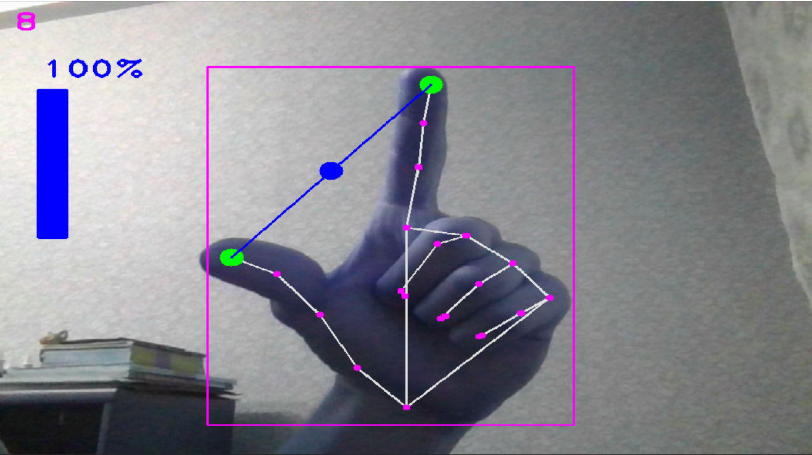

A project based on the mediapipe module and the underlying neural network. The idea is to use a webcam and finger to handle the notebook volume. There 2 modes available:

- set volume mode with a thumb and a pointing finger
- fix volume mode: requires to up a pointer and a middle fingers.

